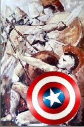
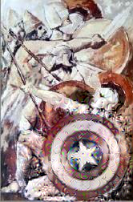

# Partial-Harmonization-Network

This project is an implementation practice of paper [*Deep Painterly Harmmonization*](https://arxiv.org/pdf/1804.03189.pdf). This network allows you to copy and paste some part of image element from other image to your target image and smooth the artifacts, such as:

Only the first step is implemented owing the time limitation. I will finish the second part after current research work.

Owing to the limitation of memory and GPU, I cannot reconstruct a large image. Please check the code and select the suitable size of output.

# Setup
  * python 3.x
  * Tensorflow
  * Keras

# Before Training
  Before reconstructing the image, you should send the materials requied by the training process. Samples of data organization can be finded in *input/painting/xxx/*
  * Pasted input, where the 
