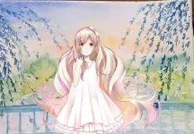
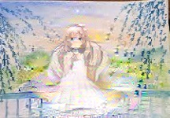

# Partial-Harmonization-Network

This project is an implementation practice of paper [*Deep Painterly Harmmonization*](https://arxiv.org/pdf/1804.03189.pdf). This network allows you to copy and paste some part of image element from other image to your target image and smooth the artifacts, such as:

 

Only the first step is implemented owing the time limitation. I will finish the second part after current research work.

Owing to the limitation of memory and GPU, I cannot reconstruct a large image. Please check the code and select the suitable size of output.

# Setup
  * python 3.x
  * Tensorflow
  * Keras

# Before Training
  Before reconstructing the image, you should send the materials requied by the training process. Samples of data organization can be finded in *input/painting/xxx/*
  * Pasted input, which is shown above.
  * bw_mask, which tells the network which part is the target and which part is the resource.
  * backgound, the original image

# Training
 To run the training, directly run the code paint-train.py. You would like to check the code and switch the path of your dataset. 
 Assuming that you have installed all the required libs and your Keras has the pretrained VGG-19 model.
 
 python paint-train.py
 
# Results
  These results can be checked in "input/painting". Considering that the results are generated through first step, the results will not be satisfying enough. Also the size of results will be small owing to the limitation of memory and GPU.
  
  
    
   
